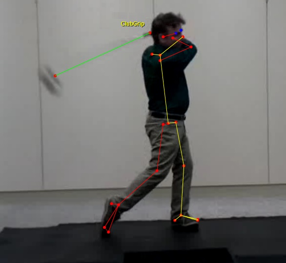
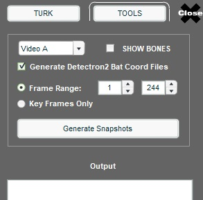

- Register an account at www.PowerChalk.com
- Download and install ChalkTalk Studio from:    https://www.powerchalk.com/tryIt
- (optional, but recommended): Watch the video to learn more about Detectron2. The demo walks through a Jupyter Notebook that demos all of what the model can do. Follow the entire lab and you'll be up and running in Google Colab having tested each model. He gives great detail, but you can just try to click through the cells and see if you can get the outputs:  https://www.youtube.com/watch?v=thHifm9cv8M  
  We’ll be doing keypoint detection. The sample Notebook doesn’t do that. Still, there's value in playing with the sample Google notebook. Mainly it proves that you’ve got a Colab and the main Detectron2 framework and libraries loaded.
- run the telestrator and sign in with your PowerChalk credentials. It will remember you after the first sign-in.
- Click “LOAD A & B VIDEOS” and in the Public folder find golf videos.  Use keyword search and try “golf” and “face on”. There are plenty to choose from.
- Claim two videos. Note the title or keywords so we can find them again. The RECENT folder holds all videos you have already looked at. Look at the file sizes as you choose and lean towards the smaller videos bc we want single swings. Also, let's stay away from portrait videos in favor of landscape.
- Hit the “Bone Data” button. Choose either ClubGrip or ClubTip. Set the “On Mouse Click” to go forward or back as you mark.
- When completely through the swing, rewind or reverse the click setting and do the other end of the club.
- Mark an entire swing and verify. OK to skip where the player is frozen.  Jump to the first real move after setup.
- Mark the grip at where the end of the club at the last point you can see it, even if between the hands of golfer. Mark the tip where the shaft meets the club head. Don’t mark out on the club head or face. The mark should always be on the actual shaft.

- Click “Save Keypoints” button.
- Make note of the first and last frame digitized.
- Hit the STAR icon in the lower left. You should be recognized as having MLTrain access and brought to this dialog. If you don’t get the dialog, you’re not MLTrain authorized. Send me the login email and I'll fix.

- Turn off show bones. Check the Generate Detectron2 box.
- Input the frame range you digitized (45-210). Click “Generate Snapshots”.
- Files will be in /documents/ChalkTalk/ml_train folder. Should be one JPG and one TXT file for each frame.
- Bring them all to a common place. Ideally a Google drive. (we can talk about these logistics)
- Run the step above as needed. It always names a frame the same so no harm in outputting it over.
- Once we have a folder full of files. We’ll tear into the model building script.
