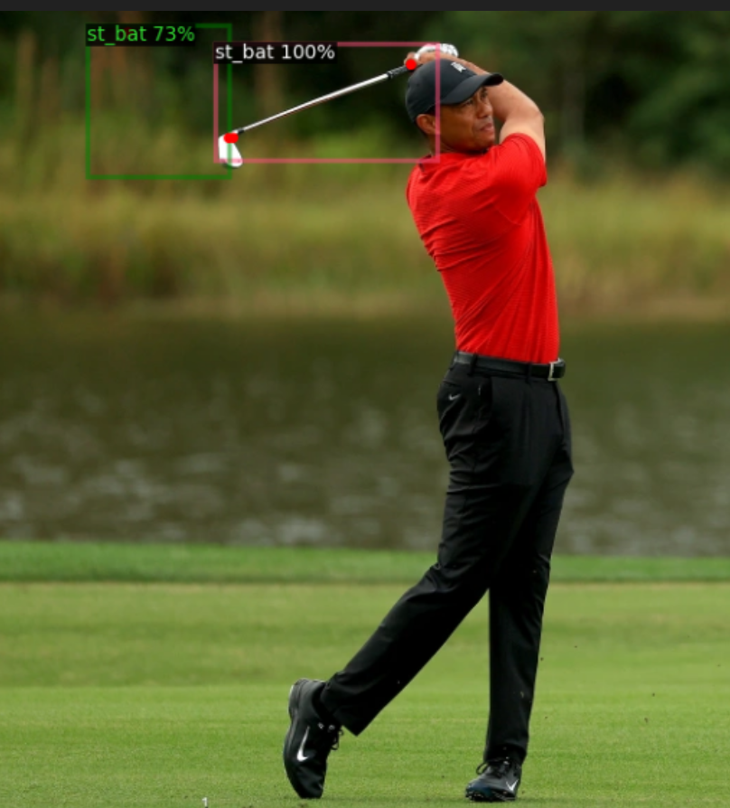

Check D2_GolfTrainMarch31_2023.ipynb for code 

Final model turns takes in a photo like this...

And returns a .txt file with the coordinates to these two points shown in the image 

With ~ 96% precision 
